# Setting up your project

First download the Godot engine from the official website via this [link](https://godotengine.org/download) and run it on your device.

After doing thatyou should see a screen like this:
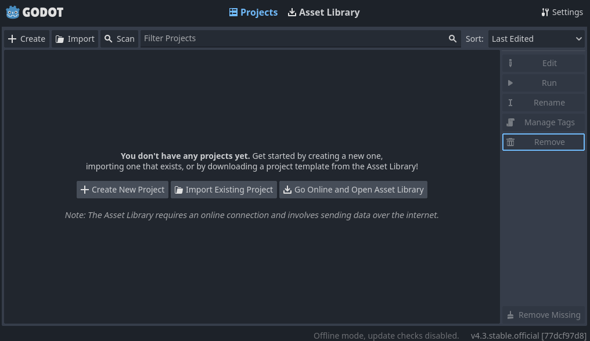
To create a project you can either press the create button in the top left or in the centre of the page
Then you can enter the project name, where the folder for the project is going to be on your device and other things.
For now keep everything besides the name and the path the same then hit the "create and edit" button.
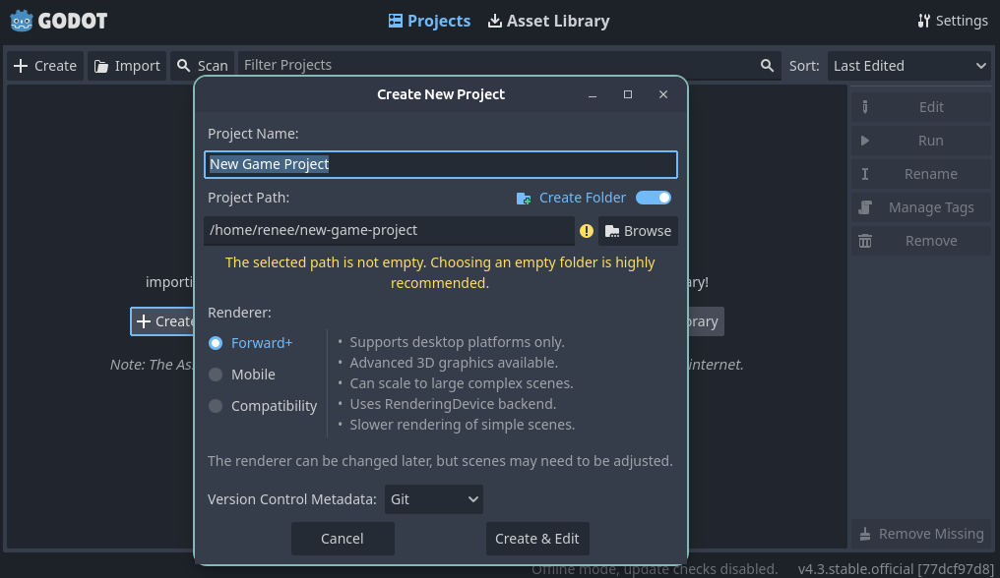

The editor interface will then open and will look something like this:
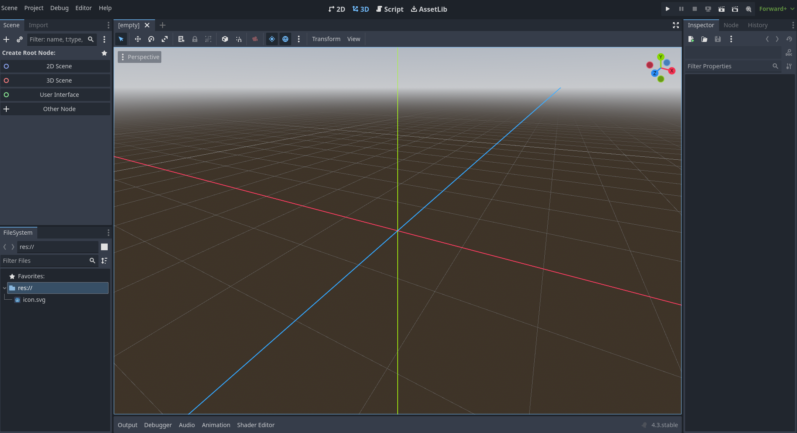
If you want to learn more about godots editor interface your can read more about it on this [page](https://docs.godotengine.org/en/stable/getting_started/introduction/first_look_at_the_editor.html) of the documentation.

But for now what we're going to do is create the main [scene](https://docs.godotengine.org/en/stable/getting_started/step_by_step/nodes_and_scenes.html#scenes).

So all your going to do is in the scene panel in the top left and click on the button labelled 2D scene, which will create a 2D node as the root for your new scene.

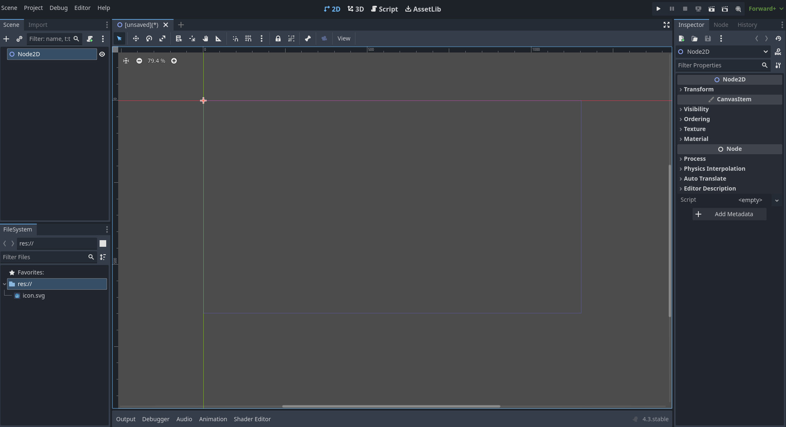

And then renaming the node to "Game" for clarity sake it by right clicking on the newly created node in the scene panel, selecting the rename option and finally entering the new name "Game" and then pressing enter.
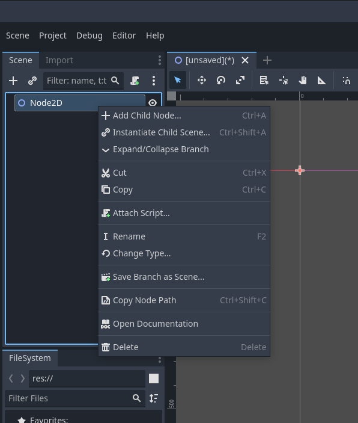
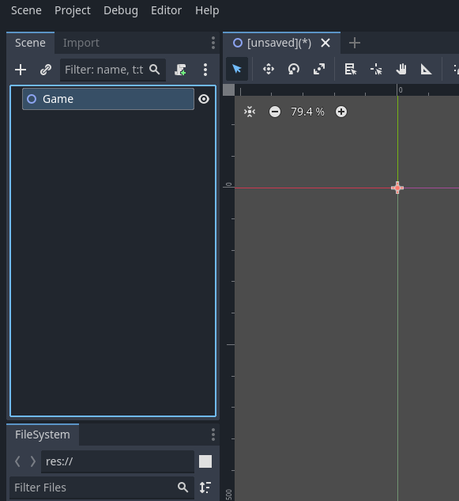

You can then save the scene by either pressing ctrl-s (or the equvilant on your device) or by pressing the scene tab on the top left of the window and then selecting save scene from there.
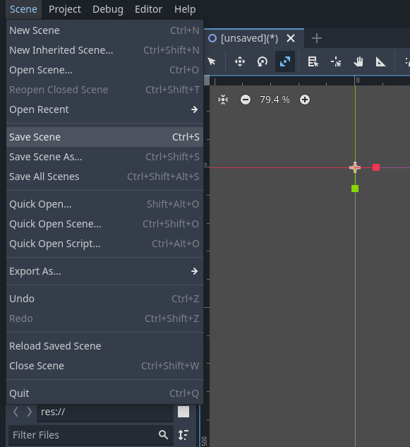

A window will then come up asking where you want to save the scene, for now just save it in the default location by just clicking save and nothing else.
 
Notice how you can now see the game scene in the filesystem panel in the bottom left of the screen.

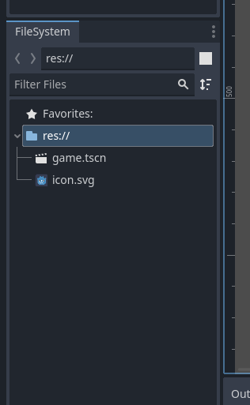

Next we're going to set the viewport width and height for the window our games going to run in by navigating to the project settings by clicking on the project tab in the top left then clicking on project settings.

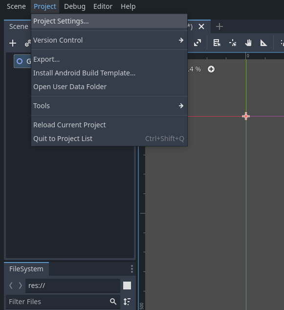

Then go to the window section, listed under display and change the viewport width to 450 and the viewport height to 720. And after that close the project settings window.
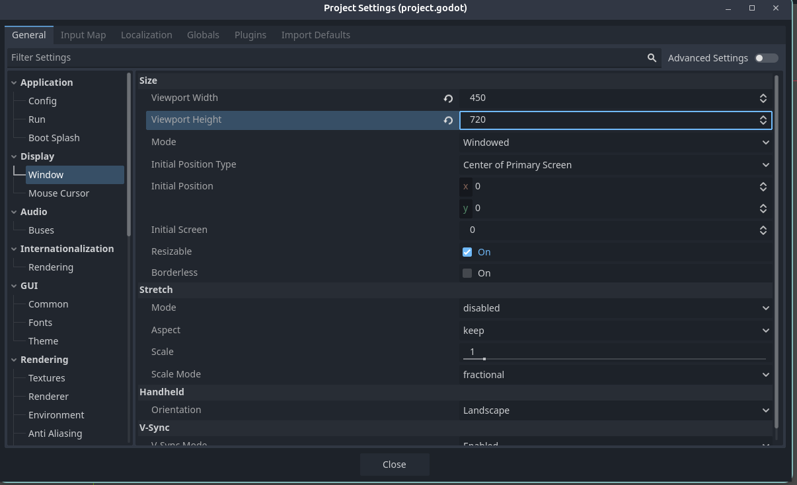

And now your ready to run your (currently empty) game.

Press the play button at the top right of the screen which will cause this notification window to come up, just click the "select current" button.
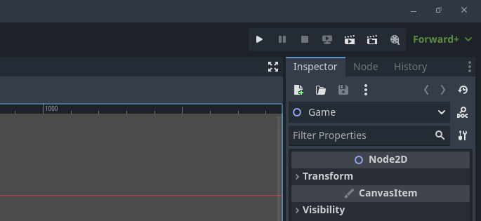
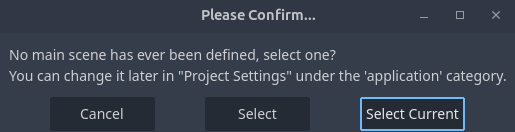

And after a few seconds, a window running the currently empty project should appear on your screen at the set viewport width and height.
