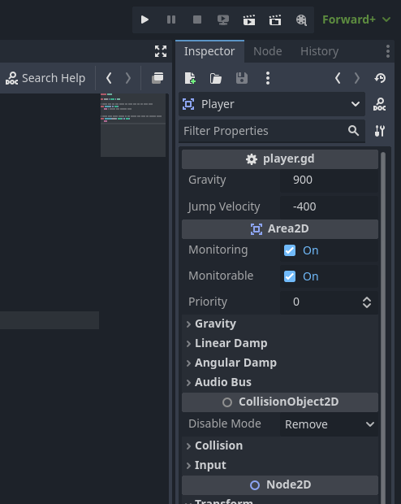
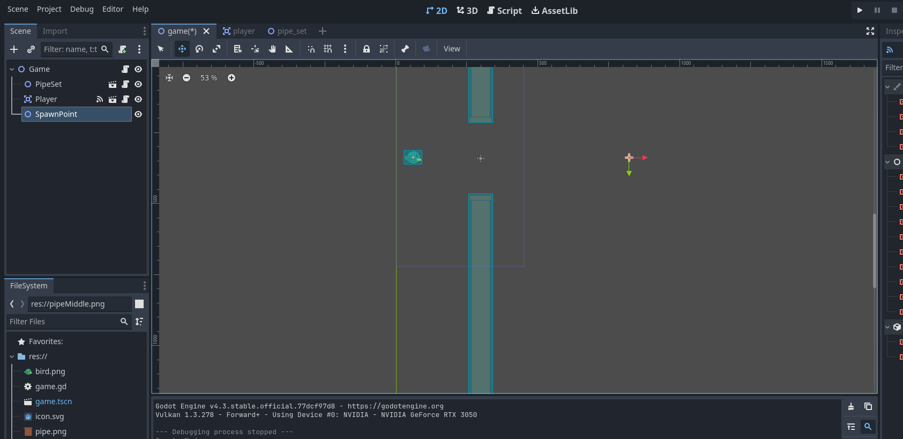
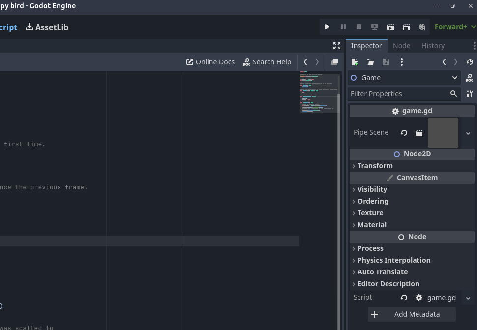
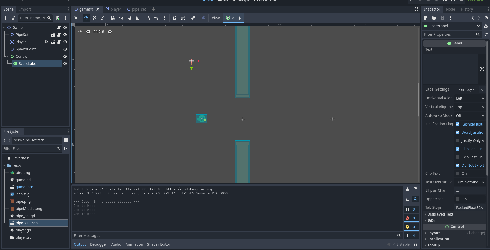
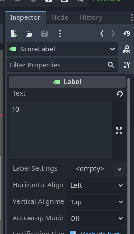
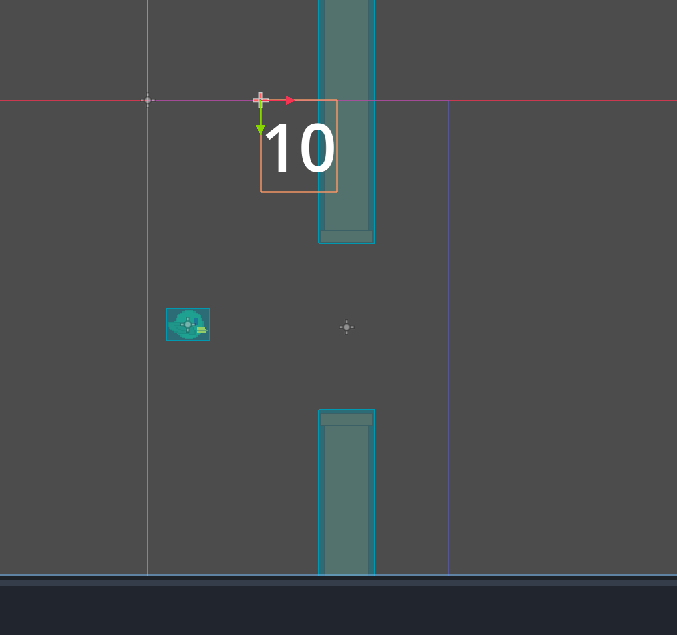
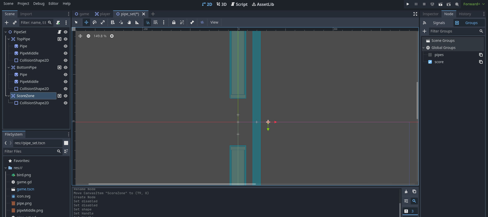

# Making your first game

Download this before starting!
zip file containing assets required: [link](https://drive.google.com/file/d/1IOSKGbzDsuDvqvXZx76mMlki5uvtw1Ln/view?usp=sharing)


## Setting up your project

First download the Godot engine from the official website via this [link](https://godotengine.org/download) and run it on your device.

Alternativly you could use the [web editor](https://editor.godotengine.org/releases/4.3.stable/godot.editor.html) instead, but I wouldn't recommend it if you can do the first option

After doing that you should see a screen like this:


To create a project you can either press the create button in the top left or in the centre of the page
Then you can enter the project name, where the folder for the project is going to be on your device and other things.
For now keep everything besides the name and the path the same then hit the "create and edit" button.


The editor interface will then open and will look something like this:


If you want to learn more about godots editor interface your can read more about it on this [page](https://docs.godotengine.org/en/stable/getting_started/introduction/first_look_at_the_editor.html) of the documentation.

But for now what we're going to do is create the main [scene](https://docs.godotengine.org/en/stable/getting_started/step_by_step/nodes_and_scenes.html#scenes).

So all your going to do is in the scene panel in the top left and click on the button labelled 2D scene, which will create a 2D node as the root for your new scene.


And then renaming the node to "Game" for clarity sake it by right clicking on the newly created node in the scene panel, selecting the rename option and finally entering the new name "Game" and then pressing enter.


You can then save the scene by either pressing ctrl-s (or the equvilant on your device) or by pressing the scene tab on the top left of the window and then selecting save scene from there.


A window will then come up asking where you want to save the scene, for now just save it in the default location by just clicking save and nothing else.
 
Notice how you can now see the game scene in the filesystem panel in the bottom left of the screen.


Next we're going to set the viewport width and height for the window our games going to run in by navigating to the project settings by clicking on the project tab in the top left then clicking on project settings.


Then go to the window section, listed under display and change the viewport width to 450 and the viewport height to 720. And after that close the project settings window.


Also go to the rendering: textures section and set default texture filter to nearest, without doing this all your sprites will look blurry.

And now your ready to run your (currently empty) game.

Press the play button at the top right of the screen which will cause this notification window to come up, just click the "select current" button.


And after a few seconds, a window running the currently empty project should appear on your screen at the set viewport width and height.


# Making the player scene
- Create a new scene by either pressing the add new scene (plus) button above the scene view or the new scene option under the scene tab on the top left
- Add a Area2D node as the root node and rename it to player
- Drag the bird image file into the scene view, creating a sprite2d node which displays that image
- In the inspector, under the Transform tab, press the undo button next to the position property to centre the sprite in the scene
- Add a CollisionShape2D node as a child to the player node and with that node selected in the inspector click on the shape property selector, click on the new RectangleShape2D and resize it to an appropriate size
- Your screen should now look something like this

- Now finally save this scene the same way you saved the game scene, go back to the game scene tab, and drag the player scene from teh filesystem tab and drag it into the scene viewport to an appropriate position.

- If you want to you can scale up the player scene to a larger size to make it more visible using the scale property under the transform section under the node2d section in the inspector
- And when you click the play button now you will actually have something on the screen.

- This is how most games in godot are structured, which allows for scenes such as enemies to be easily reusable.

# Making the player move
- To get the player bird moving we're going to need to do some scripting
- In godot any node can have a single script assigned to it at anytime, with the script being able to modify that nodes properties, eg a Node2Ds position
- Go back to the player scene tab, select the Player node, right click and then press the option to attach script
- A window will then pop up, but you don't need to change any of those settings for now, so just press the create button and the script you created with the default template will automatically pop up on your screen


- On this page there are 2 functions. Functions are a section of code that is ran everytime the function is called.
- Both of these functions are built in to the engine, meaning that they are automatically called as the game runs
- The _ready function is called when the node enters the scene tree for the first time, for the player this will be when the game starts and _process runs for every frame the node exists in the game, and the delta argument representing the amount of time since the last frame
- For example this script would make the players position.y to increase 10 units per second, moving the player bird down

```
extends Area2D

# Called when the node enters the scene tree for the first time.
func _ready() -> void:
	pass # Replace with function body.


# Called every frame. 'delta' is the elapsed time since the previous frame.
func _process(delta: float) -> void:
	position.y += 10 * delta
```

- This sort of looks like the player bird being pulled down by gravity, but something is missing, velocity and acceleration. this is because the downwards speed increases
- So what we need is a velocity value which has its downwards velocity increase over time, so something like this
```
extends Area2D

const GRAVITY : float = 10
var velocity : float

# Called when the node enters the scene tree for the first time.
func _ready() -> void:
	pass # Replace with function body.


# Called every frame. 'delta' is the elapsed time since the previous frame.
func _process(delta: float) -> void:
	velocity += GRAVITY * delta
	position.y += velocity * delta
```

- So now the bird is now falling down in a way that looks more relistic, if you look at the top of the script there is a const (as in consistant, a value that can never be changed while the script is running) float (a decimal number) called GRAVITY and a variable (a value that can be changed during runtime) float called velocity which stores the current speed the player is moving up or down (depends on if the value is currently negative or positive)
- Now lets allow the player to not only fall down but jump by pressing the space button, first navigate back to the project settings but this time, got to the top tab options on the new window and click on input map.

- Click on the add new action text box and enter the word jump and press the add button and it should now appear in the action table

- On that row, press the plus button, a new window will now pop up, as it is currently listing for the input you want to assign to the action just press the space button (or any button you want to assign to the jump action) then pressthe ok option and now you can see the space button assigned to the jump action.

- Now close that window and go back to the player script so we can use this input action to make the player jump
```
extends Area2D

@export var GRAVITY : float = 10
@export var JUMP_VELOCITY : float = -20 
var velocity : float

# Called when the node enters the scene tree for the first time.
func _ready() -> void:
	pass # Replace with function body.


# Called every frame. 'delta' is the elapsed time since the previous frame.
func _process(delta: float) -> void:
	if Input.is_action_just_pressed("jump"):
		velocity = JUMP_VELOCITY
	
	velocity += GRAVITY * delta
	
	
	position.y += velocity * delta

```
- Notice how gravity and jump_velocity are now variables and have @export written next to them? What @export does is make those values readable and editable from the inspector, so feel free to change those values to make jumping and falling feel good

- One last thing we should do is to make sure that the player doesnt go to far off screen, for now lets just limit the players y position to a certain range using the built in clamp function, we'll do with gameovers later.
- We'll also not allow the player to jump if there to close the the 'ceiling'

```
extends Area2D

@export var GRAVITY : float = 10
@export var JUMP_VELOCITY : float = -20 
var velocity : float

# Called when the node enters the scene tree for the first time.
func _ready() -> void:
	pass # Replace with function body.


# Called every frame. 'delta' is the elapsed time since the previous frame.
func _process(delta: float) -> void:
	if Input.is_action_just_pressed("jump") and position.y > 3:
		velocity = JUMP_VELOCITY
	
	velocity += GRAVITY * delta
	
	
	position.y += velocity * delta
	
	position.y = clamp(position.y, 0, 800)

```

## Making the pipe scene
- Next, what we need is a scene containg the pipes that the player has to navigate through.
- So first create a new scene with a Node2D node as its root and name it "PipeSet" and add two area2d nodes,naming them "topPipe" and "bottomPipe" as children
- Drag in two pipe sprites into the scene viewport, add them as children trotate one of them upside down and position them with the middle gap being at the origin point of the scene 
- Now add a collisionShape2d node as a child to each area2d node and assign its shape a new rectangleshape2d and size it approaprietly to the pipe sprite

- Now save this scene the same way you saved the player scene, go back to the game scene and place the pipe scene in an appropriate position to see how it looks (If you scaled up the player node in the game scene you might want to scale it up the pipes by the same value as well)

- Now go back to the PipeSet Scene and use the PipeMiddle image to make sure the pipe goes all the way to the top and bottom of the screen and change the collision shape size to reflect this.


# Making the Pipes move
- The intuitive approach to you may be to have the player bird move forward as it passes by the pipes, but in this project the pipes will be moving towards the left of the screen. This gives the illusion that the player is moving when it actually isn't.
- First go to the pipeSet Scene and attach a new script to the root node (PipeSet).
- Then we're going to do something similar to what we did to simulate gravity with the player bird, but since we're going to be moving at a controlled speed at all times, theres no need for acceleration or velocity to be stored as variables, only the speed at which the pipe is moving.
```
extends Node2D

var speed : float = -100

# Called when the node enters the scene tree for the first time.
func _ready() -> void:
	pass # Replace with function body.


# Called every frame. 'delta' is the elapsed time since the previous frame.
func _process(delta: float) -> void:
	position.x += speed * delta
```
- Note that we are now manipulating position.x instead of position.y, as position.x represents the horizontal position of the node on screen, while position.y represents the vertical position.
- Now we're going to put the speed variable in the root node of the game scene instead, so that the speed of multiple pipes can be changed at once
- So go back to the main scene and attach a script to the game node and add a speed variable to that script
```
extends Node2D

var speed : float = -100

# Called when the node enters the scene tree for the first time.
func _ready() -> void:
	pass # Replace with function body.


# Called every frame. 'delta' is the elapsed time since the previous frame.
func _process(delta: float) -> void:
	pass

```
- And now instead of using the local speed variable in the pipeset script use the speed variable from its parents instead.
```
extends Node2D

# Called when the node enters the scene tree for the first time.
func _ready() -> void:
	pass # Replace with function body.


# Called every frame. 'delta' is the elapsed time since the previous frame.
func _process(delta: float) -> void:
	position.x += get_parent().speed * delta
```

- If you click play now, you will see the pipe move across the screen, but nothing happens when you collide with it.

## Implementing gameover
- The game should end when either the player bird falls below the screen or if the player collides with one of the pipes.
- When the game ends, the pipe speed should be set to 0 and so should stop moving.

### Falling below the screen
- Detecting if the player is below the screen, just check if position.y is equal to or larger than a certain value, but getting that info to the root game node.
- For this we can use a feature of the godot game engine called signals
- So first we're going to define the signal in the player scrpt and emit it if the position.y is below the screen
```
extends Area2D

@export var GRAVITY : float = 10
@export var JUMP_VELOCITY : float = -20 
var velocity : float

# define signal
signal died()


# Called when the node enters the scene tree for the first time.
func _ready() -> void:
	pass # Replace with function body.


# Called every frame. 'delta' is the elapsed time since the previous frame.
func _process(delta: float) -> void:
	if Input.is_action_just_pressed("jump") and position.y > 3:
		velocity = JUMP_VELOCITY
	
	check_death()

	
	velocity += GRAVITY * delta
	
	
	position.y += velocity * delta
	
	position.y = clamp(position.y, 0, 800)

func check_death() -> void:
	if position.y >= 730:
		# emit signal
		died.emit()
```
- Now if you go back to the game scene, select the player node in the scene hierarchy and then on the inspector panel click on the node tab


- you will now notice in the signals, the one defined in the player script died is there. Now double click on it and this window will come up


- Click on the game node and click the connect button at the bottom of the screen and the game script will pop up with a new function created with a green symbol on the side, this function will be called whenever the player node emits the died signal.

- So all we need to do is when _on_player_died is called is to set the speed to zero and set a variable called gameover to true to keep track of this
```
extends Node2D

var gameover : bool = false
var speed : float = -100

# Called when the node enters the scene tree for the first time.
func _ready() -> void:
	pass # Replace with function body.


# Called every frame. 'delta' is the elapsed time since the previous frame.
func _process(delta: float) -> void:
	pass


func _on_player_died() -> void:
	speed = 0
	gameover = true
```

- if we go back to the player script we can now also get the gameover variable from the root game nodes script and only allow the player to jump and check for death in the _process function if the game is still running

### Colliding with pipe
- First we're going to go back to the pipe_set scene, select the TopPipe node and go to the groups tab, under the node tab from earlier.
- Groups can be used to quickly identfy nodes, eg you could assign all enemies with an enemy group.
- To add a group click the + symbol next the the filter groups text box.
- Your going to create a group called "pipes", this will be a global group, so switch that option on, then click the ok button.
- 
- Now you will notice that topPipe node now is assigned the pipes group

- now in the scene tree panel select the BottomPipe node and click the checkbox for the pipes group for that group as well.
- Now you want to go back to the player scene and go back to the signals tab, you might of already noticed but the node also has alot of built in signals, you can hover your mouse over them and see what they do.
- The signal we'll be using now is the area_entered signal, which detects when another area2d, eg one of the pipes collides with the player node.
- Double click on the signal like before but this time select the Player node the same node your connecting from then press connect


- You may notice that the function that was created has an argument (a value given to the function when it is called), we can use this variable to figure out things about what was collided with, for example the group

```
func _on_area_entered(area: Area2D) -> void:
	## area.is_in_group("pipes") returns trus if the node passed through is in the group
	if area.is_in_group("pipes") == true and !get_parent().gameover == true:
		died.emit()
```
- This code causes it so that whenever we collide with another area2d node with collision we check if it is in the group pipes and if it is and the game isn't already over it emits the died signal and does the same thing as if the player falls under the screen.
- Now play the game and try out what we've made so far.

## Spawning more pipes
- Now we've got a single pipe working, lets make the game spawn more pipes while playing the game so the player isn't left jumping in an empty void
- So first we're going to place a node in the game scene to represent the position where we want the pipes to spawn, so create a node2d in the game scene, name it SpawnPoint and place it in an appropriate position

- Now go into the game node script and lets create a new function which will instantiate a new pipe and position it at the spawn point
```
extends Node2D

# Assign pipe set scene in the node inspector
@export var pipeScene : PackedScene

var gameover : bool = false
var speed : float = -100

# Called when the node enters the scene tree for the first time.
func _ready() -> void:
	# Spawn new pipe at spawn point when game starts running
	spawn_pipe() 

# Called every frame. 'delta' is the elapsed time since the previous frame.
func _process(delta: float) -> void:
	pass


func _on_player_died() -> void:
	speed = 0
	gameover = true

func spawn_pipe() -> void:
	# Create new instance of pipeScene
	var newPipeSet : Node2D = pipeScene.instantiate()
	newPipeSet.position = $SpawnPoint.position
	# Changing scale to scale player and first pipe was scalled to
	newPipeSet.apply_scale(Vector2(2,2))
	add_child(newPipeSet)
```
- In the spawn_pipe function, a new instance of the pipeScene, which you need to assign in the inspector of the Game node), the position is set to the SpawnPoint nodes position ($SpawnPoint being short for get_node("SpawnPoint)) and added to the scene as a child of the game node (like the player)
- Now go to the inspector of the Game node and assign the Pipe Scene varialble the pipe_set scene file from the FileSystem which you created earlier

- Now when you click play a pipe should of spawned off screen and should move on screen in a couple of seconds after the game starts.
- Now we're going to make the game keep spawning pipeSets until the player dies, this can be done by adding a new variable and some lines in the process function
```
extends Node2D

# Asign pipe set scene in the node inspector
@export var pipeScene : PackedScene

var gameover : bool = false
var speed : float = -100

@export var time_between_pipes : float = 3
var time_since_last_pipe : float = 0
# Called when the node enters the scene tree for the first time.
func _ready() -> void:
	spawn_pipe() 

# Called every frame. 'delta' is the elapsed time since the previous frame.
func _process(delta: float) -> void:
	if gameover == false:
		# adds time since last frame to total time since last pipe
		time_since_last_pipe += delta
		
		# spawns pipe and reset timer if time_since_last_pipe exceeds time_between_pipes
		if time_since_last_pipe > time_between_pipes:
			spawn_pipe()
			time_since_last_pipe = 0
			


func _on_player_died() -> void:
	speed = 0
	gameover = true

func spawn_pipe() -> void:
	# Create new instance of pipeScene
	var newPipeSet : Node2D = pipeScene.instantiate()
	newPipeSet.position = $SpawnPoint.position
	# Changing scale to scale player and first pipe was scalled to
	newPipeSet.apply_scale(Vector2(2,2))
	add_child(newPipeSet)

```
- Now the game will endlessly spawn pipes until the player dies.
- But all the pipes being at the same height seems very boring, we can use random numbers generation to vary the y position of each pipe

```
extends Node2D

# Asign pipe set scene in the node inspector
@export var pipeScene : PackedScene

var gameover : bool = false
var speed : float = -100

@export var time_between_pipes : float = 3
var time_since_last_pipe : float = 0
# Called when the node enters the scene tree for the first time.
func _ready() -> void:
	spawn_pipe() 

# Called every frame. 'delta' is the elapsed time since the previous frame.
func _process(delta: float) -> void:
	# adds time since last frame to total time since last pipe
	time_since_last_pipe += delta
	
	# spawns pipe and reset timer if time_since_last_pipe exceeds time_between_pipes
	if time_since_last_pipe > time_between_pipes:
		spawn_pipe()
		time_since_last_pipe = 0
		


func _on_player_died() -> void:
	speed = 0
	gameover = true

func spawn_pipe() -> void:
	# Create new instance of pipeScene
	var newPipeSet : Node2D = pipeScene.instantiate()
	newPipeSet.position = $SpawnPoint.position
	# Changing scale to scale player and first pipe was scalled to
	newPipeSet.apply_scale(Vector2(2,2))
	add_child(newPipeSet)
```

## Scoring system
- The final thing we're going to do is have a score display that increases by 1 whenever the player passes through a pipe.
- So first lets get an on screen score counter, go to the game scenes 2D view and add a control node and a label node as a child of that node and name it "ScoreLabel"

- Now enter an example score (eg 10) into the text box in the inspector

- then go to Control - Theme Overrides - Font Sizes and increase it to a suitable size.
- Then position the text labele to a approatire position, eg top centre of the screen.

- Now lets implement an actual scoring system into the game
- What we're going to do is similar to detecting when the player collides with a pipe but instead have an invisible collisio area at the end of a pipe gap to trigger the player to send a signal and increase the score by 1.
- So go to the pipe_set scene, add a new area2d node and call it "ScoreZone", then add a CollisionShape2d as child and create a shape just like you did for the pipes just after the pipe gap, finally assign the ScoreZone node to a group named "score", making sure its global.

- Now lets go back to the player node and emit a custom signal called score whenever we collide with an object of this group
```
extends Area2D

@export var GRAVITY : float = 10
@export var JUMP_VELOCITY : float = -20 
var velocity : float

# define signal
signal died()
signal scored()


# Called when the node enters the scene tree for the first time.
func _ready() -> void:
	pass # Replace with function body.


# Called every frame. 'delta' is the elapsed time since the previous frame.
func _process(delta: float) -> void:
	if not get_parent().gameover == true:
		if Input.is_action_just_pressed("jump") and position.y > 3:
			velocity = JUMP_VELOCITY
		
		check_death()
	
	velocity += GRAVITY * delta
	position.y += velocity * delta
	
	position.y = clamp(position.y, 0, 800)

func check_death() -> void:
	if position.y >= 730:
		# emit signal
		died.emit()


func _on_area_entered(area: Area2D) -> void:
	## area.is_in_group("pipes") returns trus if the node passed through is in the group
	if area.is_in_group("pipes") == true and !get_parent().gameover == true:
		died.emit()
	if area.is_in_group("score") == true:
		scored.emit()
```
- Now you can go to the game scene and connect the player socred signal to the game node script and have that increase the score variable by 1 every time its hit

```
func _on_player_scored() -> void:
	score += 1
```

- And then finally have the game node script update the ScoreLabels text to the current score every frame in the process function

```
func _process(delta: float) -> void:
	if gameover == false:
		# adds time since last frame to total time since last pipe
		time_since_last_pipe += delta
		
		# spawns pipe and reset timer if time_since_last_pipe exceeds time_between_pipes
		if time_since_last_pipe > time_between_pipes:
			spawn_pipe()
			time_since_last_pipe = 0
		
		# str(score) converts the score integer into a string so it can be used as the label text
		$Control/ScoreLabel.text = str(score)

```


- After all that you now have a complete basic game

## Extras
- If you want to change the layering of the player and the pipe, either change the order in the scene hierarchy or mess around with CanvasItem - Ordering - z Index for the root node of theplayer and pipe scene
- If you want to add a background, you can use a colour rect node, have it cover the entire screen with and place it behind the player and pipes, (set z-index to -1)

## Possible improvements
- Add animations
- Add collectable coins to allow the player to get extra points
- increase the speed of pipe travel over time
- Add sound effects
